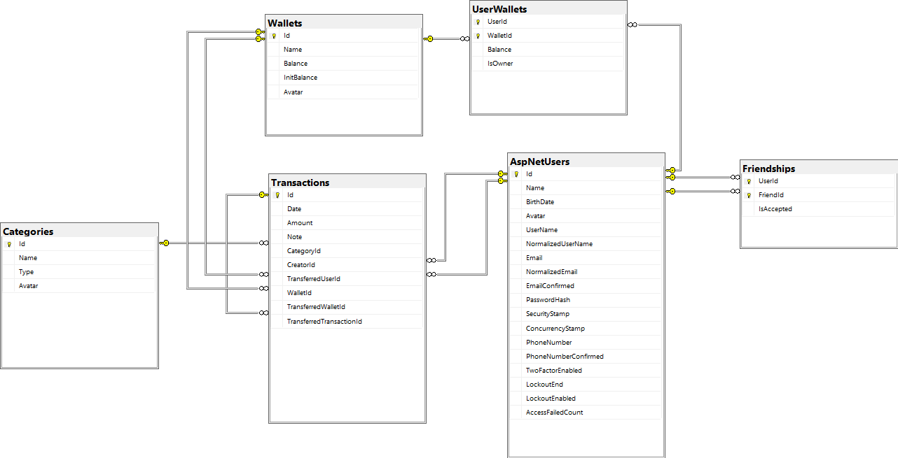

# MoneyManager
Welcome to Money Manger by Quyet Thang.

Click here to enter the web app: [moneymanagerbyquyetthang.azurewebsites.net](https://moneymanagerbyquyetthang.azurewebsites.net/)

If you find this tool useful, please feel free to give me a star.
# Context
## Motivation
Each month, I find myself grappling with my expenses, wrestling with headaches as I try to make ends meet. It's a constant struggle; I often exceed my budget, leaving my balance depleted long before the month ends. I feel lost, unsure of how to effectively manage my spending or create a sustainable financial plan. To add to the chaos, there are those spontaneous trips with friends, where keeping track of expenses feels like an impossible task. I've scoured through various tools, from Excel spreadsheets to pricey web apps boasting expense management features, but none seem to offer the solution I need. 

That's why I've taken matters into my own hands, deciding to develop a custom web app tailored to my needs. Not only will it alleviate my financial woes, but I hope it'll also prove beneficial to others facing similar struggles.

## Requirements
### Functional
1. **Wallet Management:** Users can create multiple wallets to categorize their spending. Each wallet contains a list of transactions, allowing users to organize their finances effectively.

2. **Sharing Wallets:** Users have the ability to share their wallets with other users. This feature enables collaborative budgeting or expense tracking among multiple individuals, who can also create transactions within the shared wallet.

3. **Transaction Types:** Transactions are categorized based on their nature, including:
   - Money out: Expenses or withdrawals from the wallet.
   - Money in: Income or deposits into the wallet.
   - Money transfer to another wallet: Transfers between different wallets owned by the same user.
   - Money transfer to others sharing the same wallet: Transfers between users who share a wallet.

4. **Monthly Spending Statistics:** Users can conveniently access and view statistics related to their monthly spending. This feature provides insights into expenditure patterns, helping users track their financial habits and make informed decisions.

### Non-functional
1. **Performance:** The system should respond to user interactions within 2 seconds, ensuring a smooth and responsive user experience.

2. **Maintainability:** The system should be designed with clean and modular code, following best practices and design patterns to facilitate future maintenance and updates.

## Challenges
1. Challenge 1: Facilitating wallet sharing among users necessitates embracing diverse viewpoints for each individual. For instance, within a shared wallet, every user maintains their distinct balance, alongside personalized editing privileges tailored to their needs.

2. Challenge 2: When it comes to calculating wallet balances, two main strategies emerge: either maintain and continuously update individual balances with every transaction modification, or opt not to store balances and instead recalculate them afresh whenever requested. The former entails managing the complexities of balance updates, particularly tricky when dealing with money transfers between individuals sharing the same wallet or transfers between distinct wallets. Conversely, the latter method risks performance degradation due to frequent recalculations, especially in scenarios with extensive transaction histories.

## Decision
1. To solve challenge 1, I've implemented a many-to-many relationship between the Wallet and User tables. Bridging these entities is a join-table named UserWallet, which captures both the user's balance and their ownership of the respective wallet. When retrieving a user's wallet list, I leverage joins between the Wallet and UserWallet tables. This ensures the retrieval of wallet entities accompanied by contextual information tailored to the user's specific perspective.
2. To solve challenge 1, I've opted for the initial approach of preserving wallet balances and updating them following each transactional modification. However, I've imposed limitations on editing capabilities, particularly restricting alterations to complex transactions between users and wallets. Users can only add or delete transactions and adjust the monetary amount involved, while the target recipient or source remains immutable.
   
## Database design
This is the database diagram of the system:

## Note

The implementation of backend features has been completed, but the frontend has not yet completed the features related to friendship and wallet sharing. Completion will be available in the next updated versions.
